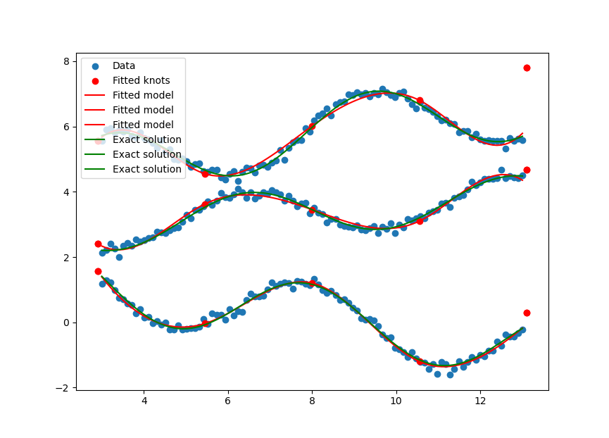
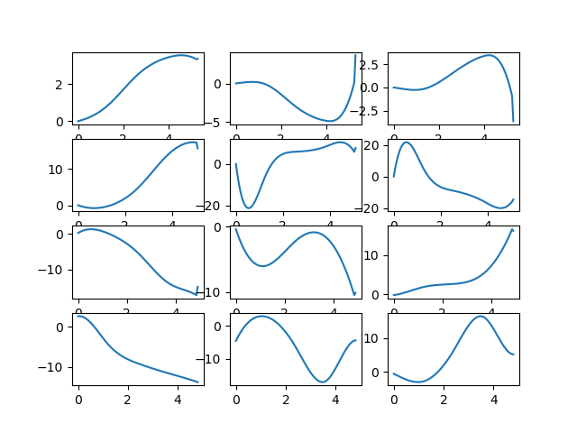

# Introduction

I'm following a small subset of the paper "KAN: Kolmogorov–Arnold Networks" on Arxiv with people from MIT, CalTech, and Northeastern University.

# Installation

In this project I need to use `pip`, since `torch` has a hard time to work with `poetry`.

To start the work environment, I wrote

```bash
python -m venv venv
source venv/bin/activate
pip install numpy matplotlib torch torchvision
```

Darn, also PyPI is failing, due to `libgomp` conflicts between `torch` and `scikit-learn`.
I only noticed this when I started to play around with the `iris` dataset.

Going to use conda. I don't know if this is because I'm using an old Mac based on intel.

```bash
conda create --name kan
conda activate kan
conda install -c conda-forge pytorch torchvision
conda install -c conda-forge scikit-learn
conda install matplotlib
```

Without the `conda-forge` options, I get trouble just as for the PyPI installation.

# Some examples

An output $y_i$ can be expressed in it's input $x_j$ by

$$
y_i = \sum_j \phi_{i,j}(x_j).
$$

Since there are efficient ways of computing higher order splines from lower order ones, I (maybe unconventionally) transpose the data before feeding it to the network. I base the spline computation on De Boor's algorithm, but modify it to compute all basis functions in one go.
I somewhat arbitrarly use $d+1$ knots at the endpoints, where $d$ is the order of the spline. With this choice I get partition of unity on the interval, and zero outsize. I'm not sure if this is the best choice. It might be useful to extend the knots a bit outside the bounds of the data to take outliers into account. Finally I also add the proposed SiLU function to stabilize the inversion. To my understanding this is good for deep networks, and I only use one layer so far, so it might not be needed at the moment.

This is the output of the script `simple_1_to_3.py` which fits three different function to one variable:



Note: I should have plotted three different plots, but they happen to be rather disjoint.

The fits for the iris dataset `iris_4_to_3.py`, gives functions $\phi_{i,j}$ after 2500 epochs, with 5 batches per epoch:



So far I'm only using 1 layer. I get 2 misclassified out of 150, doing a complete inverse crime, with identical test and training data.

Since the splines regularize the data, I'm not as concerned with overfitting as with MLPs.

If I understand the KAN-paper correctly, we can expect smoother $\phi$-functions when we use a cascade of KANs.

There are also plenty of things to consider, like bounding the outputs to a given bound, possibly allowing the last layer's output to be unbounded. That's why I only use one layer right now... Obviously, I will fix this is version 0.2 of this project.

# Cascaded KAN

I will try a slightly different approach from the famous KAN-paper. They reason that you might want to scale the weights to control eventual growth in the parameters. Since the inputs are defined on an interval, for which the spline is defined, I choose that interval to the the unit. To enforce that I just put a sigmoid inbetween each MxN KAN.

My final network (before softmax etc) becomes

$$
\bar y = (\Phi^{L-1}\circ\sigma)\circ(\Phi^{L-2}\circ\sigma)\circ\ldots\circ(\Phi^1\circ\sigma)\circ\Phi^0,
$$

i.e. we get $L$ different $\phi$ with $L-1$ different $\sigma$ inbetween them.

A first test with $L=3$, with sizes $4,4,3,3$ i.e.

$$
\Phi^0,\quad 4\times 4, \\
\Phi^1,\quad 4\times 3, \\
\Phi^2,\quad 3\times 3,
$$

each element in $\Phi$ having 8 parameters, giving a total of 296 parameters.

Optimizing this network gives a 100% accuracy, with the complete inverse crime.

A somewhat frustrating remark about not being too smart about the forward computation. I used conditional vector operations, with `torch.where(cond,true_statement,false_statement)`, and if the `cond` was false, the true_condition was still computed somehow, which caused trouble for the back propagation. I reverted back to using if statements, and there were no more problems. The error messages where very cryptic, and I scratched my head for most of the day.
